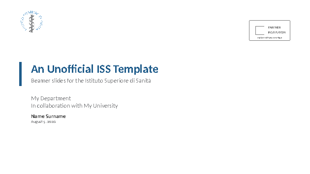
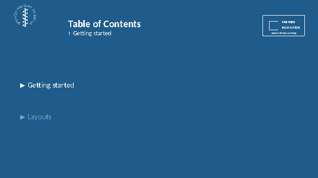
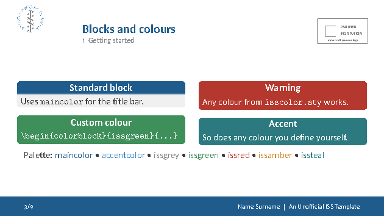
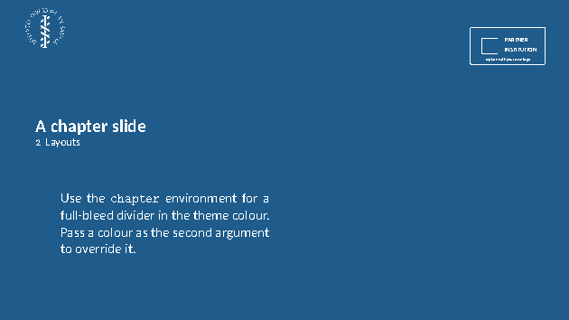
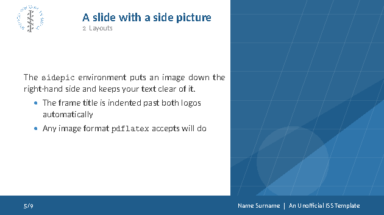
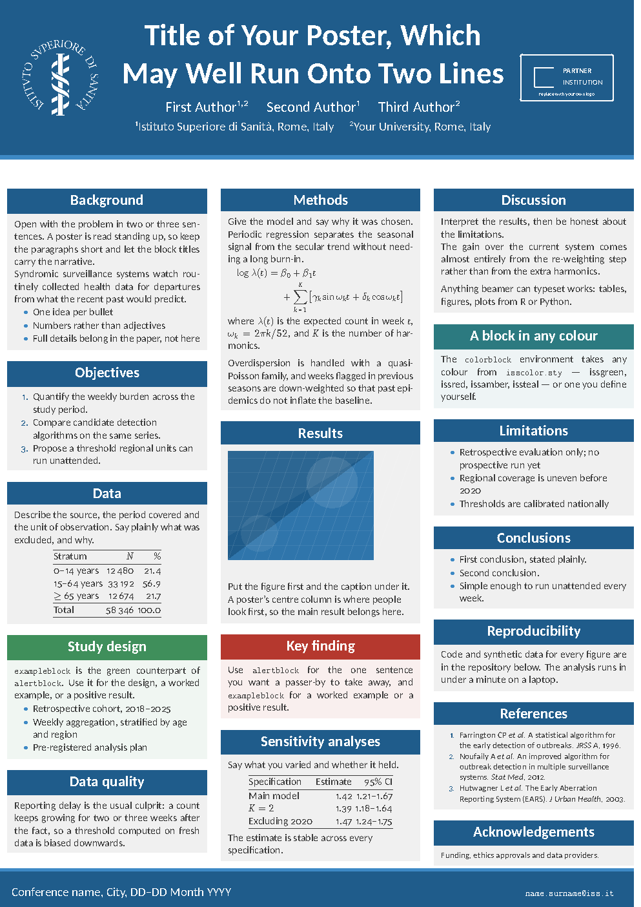

# Unofficial ISS LaTeX template

A beamer **presentation** theme and a matching **A0 poster** theme in the colours of the Istituto Superiore di Sanità, with optional dual branding for a partner university or institution.

> **This is not an official ISS template.** It is not produced, reviewed or endorsed by the Istituto Superiore di Sanità. Check with your own department before using it for anything official, and check your partner institution's brand guidelines before putting their logo on a slide.

| Title page | Section divider | Content |
|---|---|---|
|  |  |  |

| Chapter slide | Side picture | Poster |
|---|---|---|
|  |  |  |

## Download

Download the zip you need straight from this repository:

- **[`latex_presentation_template_ISS.zip`](latex_presentation_template_ISS.zip)** — the beamer deck.
- **[`latex_poster_template_ISS.zip`](latex_poster_template_ISS.zip)** — the A0 poster.

Unzip either one into your own LaTeX project (or point `TEXINPUTS` at it), then compile with **pdflatex**:

```bash
latexmk -pdf presentation.tex   # or poster.tex
```

Run pdflatex twice, or just use `latexmk`, so that the table of contents and the slide count settle. On a single pass the footline reads `n/1` because the total is not known yet.

It only needs packages that ship with a full TeX Live or MacTeX install (`beamer`, `beamerposter`, `caladea`, `carlito`, `etoolbox`, `tikz`, `ragged2e`). It works on Overleaf as-is: upload the unzipped folder and set the compiler to pdfLaTeX.

## What is in each zip

| File | What it is |
|---|---|
| `beamerthemeISS.sty` | the presentation theme — `\usetheme{ISS}` |
| `beamerthemeISSposter.sty` | the poster theme — `\usetheme{ISSposter}` |
| `isscolor.sty` | the colour palette, shared by both |
| `presentation.tex` or `poster.tex` | the demo file, and what you start from |
| `bibliography.bib` | a demo bibliography, so `\cite` works out of the box |
| `assets/` | logos and the placeholder backdrop |
| `LICENSE` | GNU GPL-3.0 |

Copy `presentation.tex` (or `poster.tex`), delete the demo content, and write your own.

## Two logos, or more

One line in the preamble turns on dual branding:

```latex
\secondlogo[assets/logo_partner_negative]{assets/logo_partner}
```

The mandatory argument is your institution's logo. The optional argument is a white ("negative") version of it, used automatically on the dark slides — the section dividers and chapter slides. If you only have one file, pass it alone and it will be used everywhere.

Once set, the partner logo appears:

- top-right of every content slide, opposite the ISS logo,
- next to the ISS logo on the title page and the closing slide,
- in the poster's header band.

Leave the command out and the deck falls back to ISS branding alone; nothing else changes. The `sidepic` environment suspends the second logo, because the picture occupies the corner it would sit in.

**Three or more institutions.** There are only two commands to remember. `\addlogo` puts a logo on the right, beside the ISS one; `\addlogoleft` puts it on the left, under the ISS one. Call either as many times as you have institutions. (`\secondlogo` is the same as `\addlogo`, except that it clears the right-hand group first — handy as the single line that sets one partner.)

Three logos — ISS on the left, the other two stacked on the right:

```latex
\secondlogo[assets/logo_partner_negative]{assets/logo_partner}
\addlogo[assets/logo_third_negative]{assets/logo_third}
```

Four logos — ISS on the left, the other three stacked on the right:

```latex
\secondlogo[assets/logo_partner_negative]{assets/logo_partner}
\addlogo[assets/logo_third_negative]{assets/logo_third}
\addlogo[assets/logo_fourth_negative]{assets/logo_fourth}
```

Four logos, balanced two and two — ISS plus one of your choosing on the left, the other two on the right:

```latex
\addlogoleft[assets/logo_partner_negative]{assets/logo_partner}
\secondlogo[assets/logo_third_negative]{assets/logo_third}
\addlogo[assets/logo_fourth_negative]{assets/logo_fourth}
```

On the **poster** each group stacks vertically, and both side slots are made as wide as the wider of the two, so the title stays centred on the page. This matters more than it sounds: with three logos side by side the demo title wraps onto five lines; stacked, it fits on two.

On the **slides** the group stays on one line, because the header band is barely a centimetre tall on a 9cm slide and stacking would push the frame titles down the page.

Either default can be overridden:

```latex
\logolayout{row}      % all on one line
\logolayout{column}   % one per line
\logolayout{grid}     % two per line
\logolayout{auto}     % the default described above
```

On the poster, `auto` stacks up to four logos and switches to a two-wide grid beyond that, where a single column would make the header very tall.

Frame titles and the poster's title block are indented by the measured width of the group, so they never collide with it however many logos you add.

Every logo is scaled to the same **height**, not the same width, so that logos of different shapes stay visually balanced:

```latex
\logoheight{1.1cm}      % slides   (poster default: 10cm)
\logomaxwidth{3.5cm}    % per-logo cap, for very wide wordmark logos
\logogap{0.02\paperwidth} % space between logos in the group
```

`assets/logo_partner.pdf` is a neutral placeholder so that the demo compiles out of the box. Replace it with your own file — no need to regenerate anything, just point `\secondlogo` somewhere else.

## Presentation commands

```latex
\usetheme[noslidenumber,nosectionpage]{ISS}
```

| Option | Effect |
|---|---|
| `noslidenumber` | hide the frame counter in the footline |
| `nosectionpage` | do not insert a table-of-contents frame at each `\section` |
| `noframesubtitle` | do not repeat "*n* Section" as every frame's subtitle |
| `nofooterpayoff` | footline shows the counter only, no author and title |

| Command | What it does |
|---|---|
| `\department{...}` | affiliation line on the title page (alias: `\course`) |
| `\IDnumber{...}` | student/matricola number after the author |
| `\titlebackground{img}` | full-bleed image behind the title page |
| `\titlebackground*{img}` | the same, in the split layout |
| `\themecolor{main}` | dark slides throughout — **preamble only** |
| `\footlinecolor{maincolor}` | coloured footline carrying author and title |
| `\footlinecolor{}` | switch it back off |
| `\toctitle{Indice}` | rename the automatic table-of-contents frame |
| `\backmattertitle{Grazie}` | text of the closing line (default "Thank you") |
| `\contacts{...}` | contact block on the closing slide |
| `\backmatter` | emit the closing slide (`\backmatter[notitle]` omits the line) |
| `\hrefcol{url}{text}` | a link in the accent colour |

`\footlinecolor` belongs in the preamble, or **between** frames to change the footline part-way through a deck. It has no effect inside a frame, because beamer typesets the footline only after the frame body has been closed.

Environments: `chapter` (full-bleed divider), `sidepic` (picture down the right-hand side), `colorblock` (a block in any colour), `withoutheadline`.

The title page, the automatic section dividers and the closing slide are not numbered and carry no footline, so the counter runs 1, 2, 3, … over your content slides only.

## Poster commands

```latex
\documentclass[final]{beamer}
\usepackage[orientation=portrait,size=a0,scale=1.55]{beamerposter}
\usetheme{ISSposter}
```

`scale` sets the base font size — raise it if the poster looks empty, lower it if your text does not fit. For landscape, change `orientation` and set `\postercolumncount{4}`.

| Command | What it does |
|---|---|
| `\institution{...}` | affiliation line under the authors |
| `\conference{...}` | left-hand side of the footer |
| `\contactline{...}` | right-hand side of the footer |
| `\postercolumncount{n}` | number of columns (default 3) |
| `\blockpadding{h}{v}` | inner padding of the block bodies (default 0.9cm, 0.8cm) |
| `\blockgap{len}` | vertical space between blocks (default 1.5cm) |
| `\logolayout{...}` | `auto`, `row`, `column` or `grid` (poster default: stacked) |
| `\addlogoleft[neg]{f}` | put an extra logo beside the ISS logo, on the left |

Lay the body out with:

```latex
\begin{postercolumns}
  \postercolumn{ ...blocks... }
  \postercolumn{ ...blocks... }
  \postercolumn{ ...blocks... }
\end{postercolumns}
```

Column widths and gutters are computed from the column count, so the columns always line up with the text margins. `block`, `alertblock`, `exampleblock` and `colorblock` are all styled to match the slides.

## Colours

The palette lives in `isscolor.sty` and is shared by both themes.

| Name | Hex | Where it comes from |
|---|---|---|
| `maincolor` | `#1F5C8B` | the logo blue, darkened for contrast |
| `accentcolor` | `#3D89C5` | the exact blue of the ISS logo |
| `issgrey` | `#87888A` | the exact grey of the ISS logo |
| `isslightgrey` | `#F0F0F0` | block bodies |
| `issgreen` `issred` `issamber` `issteal` | | secondary accents |

`maincolor` is a deliberately darkened version of the logo blue: white text on `#3D89C5` reaches only 3.0:1 contrast, which is unreadable on a projector, while `#1F5C8B` reaches 6.6:1. To re-skin everything at once, change the single `\colorlet{maincolor}{...}` line in `isscolor.sty`.

## Credits and licence

This theme is a re-skin of a chain of earlier work:

- [SINTEF Presentation theme](https://github.com/federicozenith/sintefbeamer) by Federico Zenith,
- itself derived from `beamerthementnu` by Håvard Berland,
- adapted for Sapienza University of Rome by [Andrea Gasparini](https://github.com/andrea-gasparini/sapienza-beamer-template), which is what this template started from.

Released under the **GNU General Public License v3.0**, the same licence as the templates it derives from. See [LICENSE](LICENSE).

The ISS logo is the property of the Istituto Superiore di Sanità and is included here for use by people working at or with the institute; it is not covered by the GPL.
